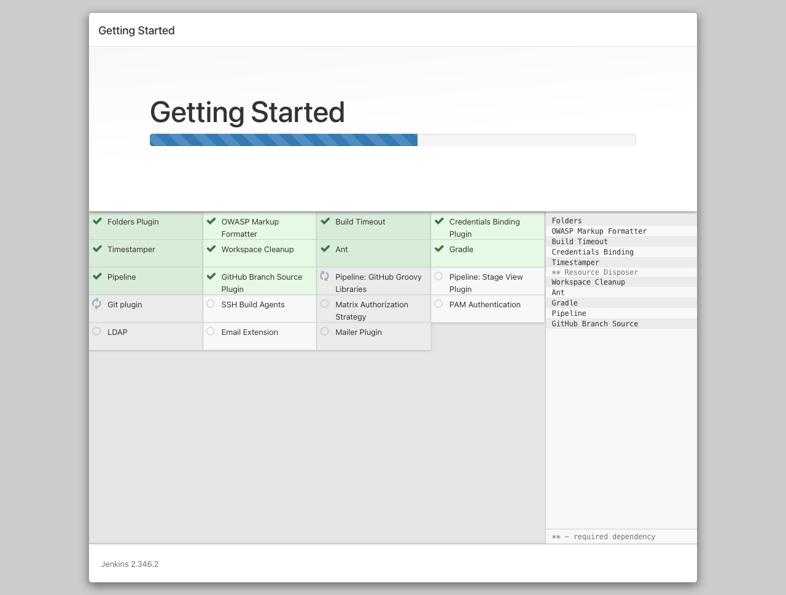

# Sevidor Jenkins sobre Docker
En este repositorio veremos como usar **Docker** para ejecutar un servidor de **Jenkins** de forma rápida y segura.

## Prerequisitos
* Computador con Mac, Linux o Windows (en el peor de los casos)
* [Docker](https://docs.docker.com/get-docker/)

## Estructura del proyecto
* jenkins-docker-lab/
    - jenkins/ # Directorio que contiene la receta de la imagen de docker para jenkins
    - resouces/ # Directorio con recursos para el README.md
    - docker compose.yml # Definición para la ejecución del servicio de jenkins
    - README.md # Ésta documentación

## Iniciar el servidor
A continuación veremos el paso a paso para iniciar nuestro servidor y la configuración inicial, para tener en cuenta dentro del directorio *jenkins* vas a encontrar el archivo *plugins.txt* en este podras personalizar los plugins necesarios para que se instalen automaticamente al momento de crear la imagen.

1. Descarga o clona este repositorio
2. En la raiz del repositorio ejecuta en una terminal el siguiente comando: `docker compose build` esto nos debe construir la imagen Docker.
3. Con la imagen construida vamos a ejecutar el servidor con el siguiente comando: `docker compose up``
4. Con el comando anterior si todo va bien en la terminal deberemos ver que el servicio de Jenkins empieza a subir y la primera vez que lo ejecutemos nos va a generar una contraseña aleatoria y única, como se muestra a continuación: 
5. El servicio de *Jenkins* usa por defecto el puerto *8080* por lo tanto vamos a acceder *http://localhost:8080* (suponiendo que lo ejecutas en tu máquina local, sino debes usar la IP de la máquina remota en lugar de *localhost*) y deberías observar el "wizard" de instalación, de la siguiente manera:  donde pondremos la contraseña generada en el paso anterior. *Nota: recuerda que es la que te generó en tu máquina y no la del ejemplo.*
6. El wizard nos va a sugerir instalar algunos plugins, tienes la opción de instalar los sugeridos o escogerlos manualmente.  y posteriormente se van a instalar 
7. Crea tu usuario, tienes la opción de crear un usuario o seguir usando el admin con la opción de "saltar y continuar como admin". 
8. Confirma la URL del servidor, aquí podras definir un dominio si lo tienes por defecto va a usar localhost o la IP remota. 
9. Finaliza la configuración inicial haciendo clic en "restart" o "reinciar".  A continuación el contenedor se va a reiniciar, en algunos casos este reinicio puede hacer que el contenedor muera, por lo tanto si se llega a presentar simplemente debes volver a subirlo con el comando `docker compose up -d`. El parametro "-d" va a permitir que el contenedor corrar en background sin mostrarnos los logs, si queremos ver los logs del contenedor podemos ejecutar `docker compose logs -f`. Y sabremos que el servicio está listo cuando veamos algo como: *Jenkins is fully up and running* 
10. Accedemos nuevamente a *http://localhost:8080* (O la IP/Dominio que corresponda) y podremos hacer login con el usuario admin o el que hayamos configurado durante la instalación. 
11. Si todo ha salido bien, ya tendremos un servidor de *Jenkins* listo para empezar a *jugar*. 